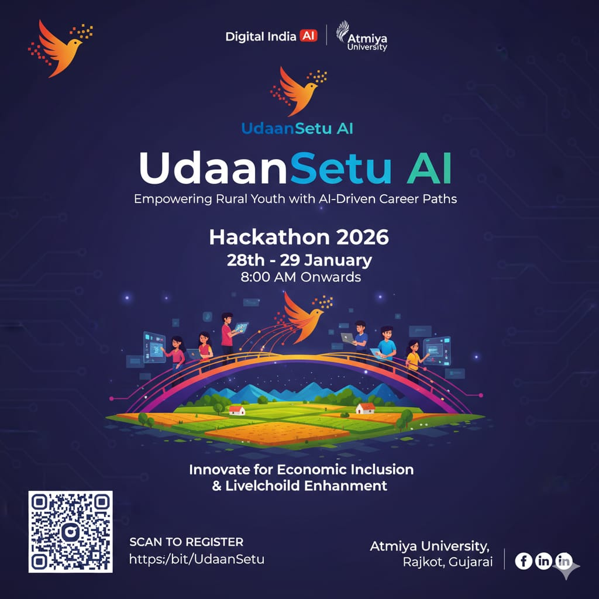

<div align="center">

# 🚀 UdaanSetu.AI

### _Bridging Rural Dreams to Digital Futures_

[](https://github.com/dhruvpatel16120/UdaanSetu.AI)
[](https://nextjs.org)
[]()

---

<p align="center">
  <br>
  <b>UdaanSetu.AI</b> is an AI-powered Career Mentor designed specifically for <b>rural youth</b> (Class 10-12, Dropouts). It combines <b>psychometric assessment</b>, <b>real-time market data</b>, and <b>generative AI</b> to build personalized career bridges that are realistic, actionable, and culturally relevant.
  <br>
</p>

</div>

---

## 🛑 The Problem

Rural youth in India face a **"Guidance Gap"**:

1.  **Information Asymmetry**: Access to internet exists, but access to _curated, relevant career paths_ does not.
2.  **Language Barrier**: Most high-quality career advice is in English, alienating vernacular speakers.
3.  **Generic Advice**: LLMs give generic answers ("Become a Data Scientist") without considering the student's _economic reality, education level, or local constraints_.

## 💡 The Solution

**UdaanSetu.AI** (Udaan = Flight, Setu = Bridge) acts as a specialized **AI Career Counselor**:

- **🧠 Deep Profiling**: Uses a game-like, multilingual Q&A assessment to map **Psychology** (Risk, Creativity), **Background** (Family Income, Mobility), and **Interests**.
- **📊 Dynamic Factor Analysis**: Scores users on "Billionaire Mindset", "Start-up Aptitude", or "Stable Job Fit".
- **🤖 RAG-Powered Reports**: Uses **Retrieval Augmented Generation** (Gemini) to fetch real education roadmaps, scholarships, and salary trends relevant to the user's specific profile.
- **🌍 Vernacular First**: Digital equity through native **Gujarati & English** support.

---

## 🛠️ Technology Stack

| Domain       | Technology                       | Purpose                                                                 |
| :----------- | :------------------------------- | :---------------------------------------------------------------------- |
| **Frontend** | **Next.js 14**, **Tailwind CSS** | High-performance, SEO-friendly, and beautiful Glassmorphism UI.         |
| **Backend**  | **Python FastAPI**               | Fast, async REST API for handling complex logic and AI orchestration.   |
| **AI / LLM** | **Google Gemini Pro**            | Generates empathetic, context-aware career reports and roadmaps.        |
| **Database** | **Firebase Firestore**           | Scalable NoSQL real-time database for user profiles and history.        |
| **Styling**  | **CSS Modules + Tailwind**       | Custom animations (**FadeIn**, **Glow**, **Float**) for a premium feel. |

---

## 🎨 Key Features

### 1. 🎭 Gamified Assessment Engine

> Don't just ask "What do you want to be?". Ask "How do you play games?"

- 20+ Adaptive Questions.
- Maps **Traits**: Leadership, Mobility, Financial Attitude.
- Logic-based filtering (Static vs Dynamic layers).

### 2. ⚡ "Mind-Blowing" UI/UX

- **Glassmorphism Design**: Frosted glass effects, vibrant gradients, and ambient lighting.
- **Micro-Interactions**: Hover glows, smooth page transitions, and interactive inputs.
- **Responsive**: Fully optimized for low-end mobile devices common in rural areas.

### 3. 📝 AI Career Report (RAG)

- **SWOT Analysis**: Strengths, Weaknesses, Opportunities, Threats.
- **3 Tailored Paths**:
  - _The Safe Path_ (Government/Stable Jobs)
  - _The Growth Path_ (Tech/Private Sector)
  - _The Dream Path_ (Entrepreneurship/Creative)
- **Actionable Roadmap**: 6-month step-by-step learning guide.

---

## 📸 Screenshots

<div align="center">
  <table>
    <tr>
      <td align="center"><b>Home Page</b></td>
      <td align="center"><b>Assessment</b></td>
      <td align="center"><b>Dashboard</b></td>
    </tr>
    <tr>
      <td></td>
      <td></td>
      <td></td>
    </tr>
  </table>
</div>

---

## 🚀 Getting Started

### Prerequisites

- Node.js 18+
- Python 3.10+
- Google Gemini API Key
- Firebase Service Account

### Installation

1. **Clone the Repo**

   ```bash
   git clone https://github.com/dhruvpatel16120/UdaanSetu.AI.git
   cd UdaanSetu.AI
   ```

2. **Backend Setup**

   ```bash
   cd backend
   python -m venv venv
   source venv/bin/activate  # On Windows: venv\Scripts\activate
   pip install -r requirements.txt
   # Place your 'serviceAccountKey.json' in this folder
   uvicorn main:app --reload
   ```

3. **Frontend Setup**

   ```bash
   cd frontend  # (Formerly UdaanSetu.AI)
   npm install
   npm run dev
   ```

4. **Launch**
   - Open `http://localhost:3000` for the app.
   - Open `http://localhost:8000/docs` for API documentation.

---
## 👥 Team FutureMinds

| Role | Name | Contribution |
|------|------|--------------|
| **Team Leader & System Architecture** | **Dhruv Patel** | Overall system design, architecture planning, and AI strategy |
| **Frontend & UI/UX** | **Prajwal Yadav** | User interface design, user experience, and frontend development |
| **Research & Content** | **Kalyani Sanjarkhan** | Psychometric research, career content creation, and assessment models |
| **Backend & AI Integration** | **Vasu Patil** | Backend development, API design, and AI model integration |

---

<p align="center">
  Made with ❤️ for <b>India</b> 🇮🇳
</p>
