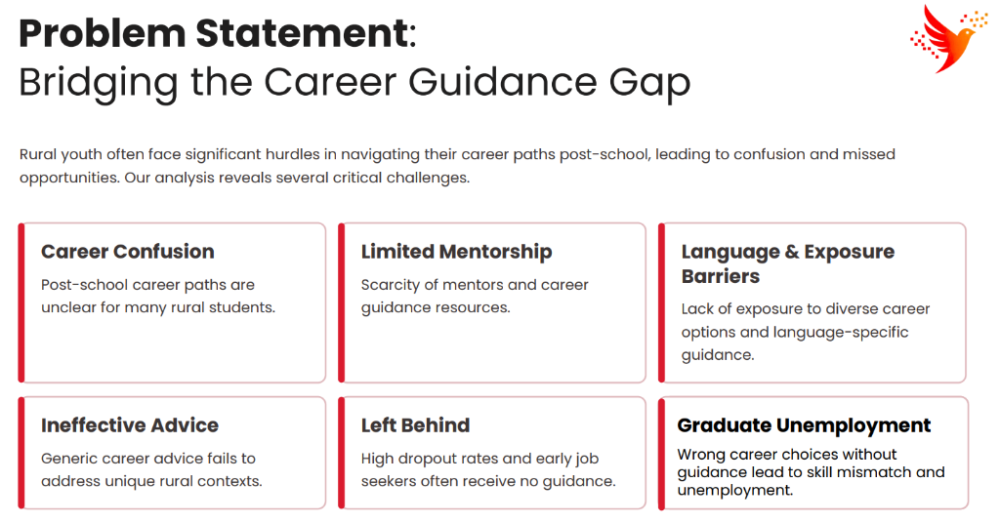
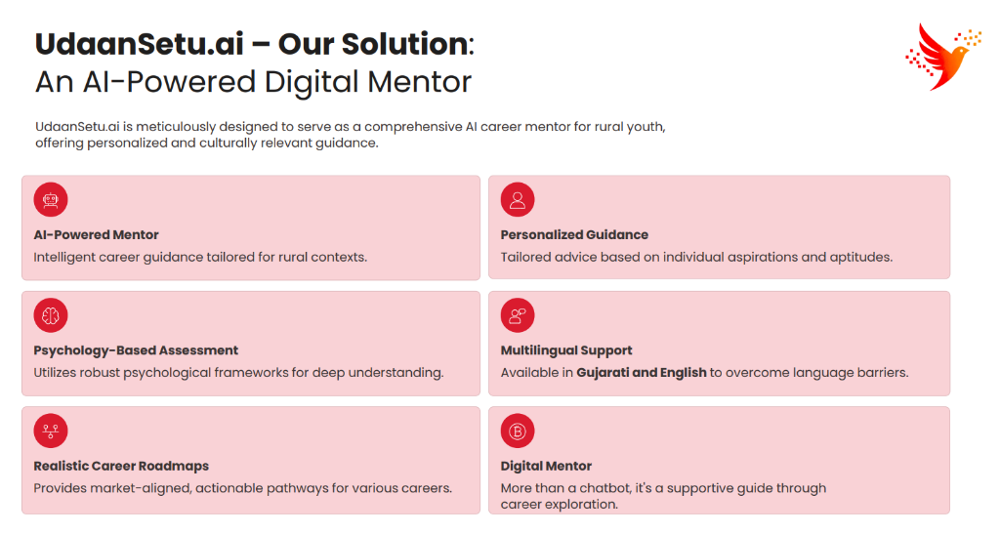
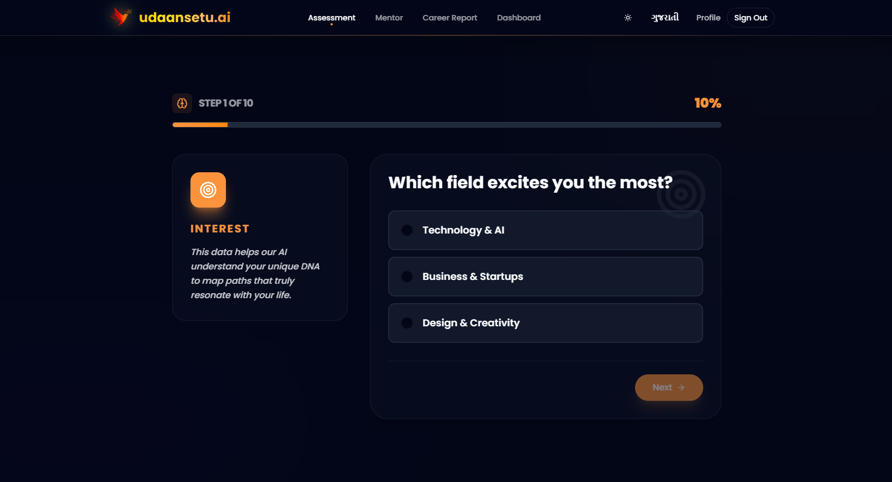

# <p align="center">🚀 UdaanSetu.AI</p>

<p align="center">
  
</p>

<p align="center">
  <strong>"A bridge from rural dreams to digital careers."</strong>
</p>

<p align="center">
  
  <a href="https://udaansetuai.vercel.app/">
    
  </a>
  
  
</p>

<p align="center">
  
  
  
  
  
</p>

---

## 📖 Overview

**UdaanSetu.AI** is a sophisticated AI-powered digital career and skill mentor specifically engineered for rural Indian youth (Class 10th, 12th, or dropouts). Our platform acts as a bridge, guiding students through the complex transition from post-school confusion to digital career success using culturally rooted, regional language support.

> 🌟 **Hackathon Prototype:** This project was developed to demonstrate the feasibility of localized AI mentorship in bridging the digital divide.

---

## 🚩 Problem Statement

Rural youth in India face a significant **"Guidance Gap"** that limits their economic mobility. Despite having mobile access, they lack the curated, localized mentorship needed to navigate modern career paths.

<p align="center">
  
</p>

### The Challenges:

- **Career Confusion**: Most students are aware of only 2-3 traditional career paths.
- **Mentorship Scarcity**: Lack of access to professional career counselors in rural districts.
- **Language Barrier**: High-quality digital resources are predominantly in English.
- **Generic Guidance**: Conventional AI tools provide generic advice that ignores local economic realities.

---

## 💡 Our Solution: UdaanSetu.AI

We have built an **AI-Powered Digital Mentor** that provides personalized, culturally relevant, and linguistically accessible guidance to every rural student.

<p align="center">
  
</p>

### The Innovation:

- **🧠 Psychometric Intelligence**: Goes beyond "interests" to map psychological traits like risk appetite and resilience.
- **🌍 Vernacular First**: Native **Gujarati** support ensures no student is left behind due to language.
- **📊 RAG-Driven Grounding**: Unlike generic chatbots, we use **Retrieval-Augmented Generation** to provide roadmap data based on real-world scholarships and localized trends.
- **🗺️ Actionable Roadmaps**: We don't just suggest careers; we provide 6-month step-by-step blueprints to achieve them.

---

## 🎯 About the Project

Rural students often lack access to personalized, expert career guidance. They face language barriers, generic advice, and a lack of role models. **UdaanSetu.AI** solves this by:

- Navigating career confusion in **Gujarati** and **English**.
- Performing **Psychometric Assessments** to map professional traits.
- Generating **AI-Driven Roadmaps** grounded in real-market data via **RAG**.
- Providing a **Persistent AI Mentor** for continuous conversation.

> ⚠️ **Note:**
> Google Gemini API might not work in the live prototype due to strict quota limits. For a fully functional experience, we recommend setting up the project locally with your own **Gemini API Key**.

---

## ✨ Features

- **🎯 Adaptive Assessment**: A dynamic Q&A engine that maps leadership, risk appetite, and creative traits.
- **📊 Deep SWOT Analysis**: Analyzes student data to identify internal strengths and external opportunities.
- **🗺️ Interactive Roadmaps**: Step-by-step 6-month plans for career success.
- **🤖 RAG-Based Mentor**: A context-aware chat mentor that answers questions based on your specific report and local job trends.
- **🎨 Glassmorphism UI**: A premium, "mind-blowing" interface optimized for mobile devices.
- **🌍 Vernacular First**: Native-level support for Gujarati to ensure digital equity.

---

## 🖼️ Prototype Preview

### Screenshots

<div align="center">
  <table>
    <tr>
      <td align="center"><b>Home & Branding</b></td>
      <td align="center"><b>Adaptive Assessment</b></td>
      <td align="center"><b>Career Dashboard</b></td>
    </tr>
    <tr>
      <td></td>
      <td></td>
      <td></td>
    </tr>
  </table>
</div>

### 📺 Demo Video

📽️ **[Watch the Prototype Demo on YouTube](https://www.youtube.com/watch?v=dQw4w9WgXcQ)**

---

## 🛠️ Tech Stack

| Layer             | Technology                  | Badge                                                                                                      | Purpose                                |
| :---------------- | :-------------------------- | :--------------------------------------------------------------------------------------------------------- | :------------------------------------- |
| **Frontend**      | **Next.js 16 (App Router)** |              | High-performance, SEO-friendly UI.     |
| **Backend**       | **Python (FastAPI)**        |             | Async REST API & AI Orchestration.     |
| **Generative AI** | **Google Gemini 1.5**       |   | Core intelligence for analysis & chat. |
| **Orchestration** | **LangChain**               |       | RAG chain management.                  |
| **Database**      | **Firebase Firestore**      |          | Real-time user session storage.        |
| **Retrieval**     | **JSON (Serverless)**       |                      | Keyword-based search (No Vector DB).   |
| **Styling**       | **Tailwind CSS 4.0**        |  | Modern utility-first CSS.              |

---

## 📂 Project Structure

```bash
UdaanSetu.AI/
├── frontend/             # Next.js 15 Web Application
│   ├── app/              # App Router Pages & Components
│   ├── components/       # Reusable UI Elements (Glassmorphism)
│   ├── services/         # Firebase & API Handlers
│   └── constants/        # i18n Translations (Gujarati/English)
├── backend/              # Python FastAPI Intelligence Layer
│   ├── app/              # Main Logic (Assessment, RAG, Mentor)
│   ├── scripts/          # Index builders & Maintenance
│   ├── data/             # Knowledge Base (PDFs/JSONs)
│   └── main.py           # Entry Point & Vercel Handler
├── visuals/              # Logos, Screenshots, and Assets
├── vercel.json           # Monorepo Deployment Config
├── documentations.md     # Technical System Hub
└── deployment_guide.md   # Step-by-step Hosting Guide
```

---

## 🚀 Installation & Setup

### 1. Clone the Repository

```bash
git clone https://github.com/dhruvpatel16120/UdaanSetu.AI.git
cd UdaanSetu.AI
```

### 2. Environment Configuration

UdaanSetu requires several environment variables for Firebase and Google Gemini to work.

- See **[` .env.example.txt`](./.env.example.txt)** for the required template.
- Create a `.env` file in the `frontend/` directory and another in the `backend/` directory based on the template.

### 3. Component Setup

Detailed instructions for setting up each part of the monorepo:

- 🎨 **[Frontend Setup Guide](./frontend/README.md)**: Node.js, Tailwind, and Firebase Web Client.
- ⚙️ **[Backend Setup Guide](./backend/README.md)**: Python environment, AI keys, and Knowledge Base.

---

## 🏃 Usage

Once both services are running:

1.  Navigate to **`http://localhost:3000`** in your browser.
2.  Log in using Google or Email.
3.  Take the **Adaptive Assessment**.
4.  Generate your **Career Report**.
5.  Start a conversation with your **AI Mentor**.

---

## 📖 Documentation

For a technical deep-dive into our **Module 1 (Bio-Profiler)**, **Module 2 (Deep Thinker)**, and **Module 3 (Guide)**, please visit our **[Technical Documentation Hub](./documentations.md)**.

---

## 🤝 Contribution & Support

We welcome contributions! To help us empower rural youth:

1.  **Fork** the project.
2.  Create your **Feature Branch** (`git checkout -b feature/AmazingFeature`).
3.  **Commit** your changes (`git commit -m 'Add some AmazingFeature'`).
4.  **Push** to the branch (`git push origin feature/AmazingFeature`).
5.  Open a **Pull Request**.

---

## 📧 Contact

**Dhruv Patel** - [dhruvpatel16120@gmail.com](mailto:dhruvpatel16120@gmail.com)  
**Project Link**: [https://github.com/dhruvpatel16120/UdaanSetu.AI](https://github.com/dhruvpatel16120/UdaanSetu.AI)

---

## 👥 Team FutureMinds

| Member                 | Role                               | Link                                                          |
| :--------------------- | :--------------------------------- | :------------------------------------------------------------ |
| **Dhruv Patel**        | Team Leader & System Architect     | [LinkedIn](https://www.linkedin.com/in/dhruvpatel16120/)      |
| **Prajwal Yadav**      | Frontend & UI/UX Designer          | [LinkedIn](https://www.linkedin.com/in/mr-prajwal-yadav/)     |
| **Kalyani Sanjarkhan** | Research & Testing                 | [LinkedIn](https://www.linkedin.com/in/sanjarkhan-gec-ai-ds/) |
| **Vasu Patil**         | Representative & Backend Architect | [LinkedIn](https://www.linkedin.com/in/gecr-comp-d2dce02/)    |

---

## 📄 License

Distributed under the **Apache License 2.0**. See [`LICENSE`](./LICENSE) for more information.

---

## 🏆 Copyrights & Credits

- 🎨 **Creative Assets**: All icons and logos were custom-created by **Team FutureMinds**.
- ✨ **Design Philosophy**: UI inspired by **Glassmorphism** and modern Indian design trends.
- 🧠 **AI Intelligence**: Core logic and reasoning powered by **Google Gemini**.

---

### 🌟 Support Our Mission

If you find **UdaanSetu.AI** impactful or useful, please consider giving this repository a **Star**! Your support helps us gain visibility and continue building tools to bridge the digital divide for rural India.

[](https://github.com/dhruvpatel16120/UdaanSetu.AI)

<p align="center">Made with ❤️ for Rural India by <b>FutureMinds Team</b></p>
