# 📚 LeanRAG: The Serverless Knowledge Engine

> **"Intelligence without the weight."**

This guide details the architecture and usage of **LeanRAG**, the custom lightweight Retrieval-Augmented Generation engine powered by **UdaanSetu.AI**.

---

## 🏗️ Architecture Overview

Unlike traditional RAG systems that rely on heavy vector databases (FAISS, Pinecone) and machine learning libraries (Torch, Transformers) which exceed Vercel's 250MB deployment limit, **LeanRAG** is designed for **pure serverless efficiency**.

```mermaid
graph LR
    A[📂 JSON Data Files] -->|Load on Start| B[🧠 Local Memory]
    C[👤 User Query] -->|Keyword Analysis| D[🔍 LeanRAG Engine]
    B --> D
    D -->|Top k Results| E[📝 Context]
    E --> F[🤖 Gemini LLM]
    F --> G[💬 Answer]
```



### Key Benefits
- **🚀 Zero Build Step**: No need to run indexing scripts. Data is live instantly.
- **⚡ Millisecond Latency**: In-memory keyword search is faster than HTTP vector DB calls.
- **☁️ Vercel Compatible**: Removes `torch` (800MB+) and `faiss` (50MB+), reducing bundle size to <50MB.

---

## 📂 Knowledge Base Structure

The engine automatically loads data from the `backend/app/data/` directory.

### Supported Data Sources
The system currently watches these specific files:
- `careers.json`: Detailed career paths, salaries, and requirements.
- `roadmaps.json`: Step-by-step guides (6-month/1-year plans).
- `skills.json`: Technical and soft skills descriptions.
- `government_schemes.json`: scholarship and rural aid info.

### 🧬 Recommended JSON Schema

While LeanRAG accepts any valid JSON structure, we recommend the following schema for optimal search performance:

```json
[
  {
    "id": "career_web_dev",
    "title": "Full Stack Web Developer",
    "category": "Technology",
    "description": "A developer who works on both frontend and backend...",
    "keywords": ["html", "css", "javascript", "react", "node"],
    "salary_range": "₹3L - ₹12L",
    "roadmap": [
      "Month 1-2: HTML/CSS",
      "Month 3-4: JavaScript & React"
    ]
  }
]
```

> **💡 Tip:** The search algorithm flattens the JSON to a string. Including unique `keywords` significantly improves retrieval accuracy.

---

## 🛠️ Managing Knowledge

Adding knowledge to the AI Mentor is now as simple as editing a text file.

### Adding a New Career Entry

1.  Navigate to `backend/app/data/`.
2.  Open `careers.json`.
3.  Append a new object to the main list:
    ```json
    {
      "title": "Drone Pilot",
      "description": "Operate drones for agriculture and surveying...",
      "skills": ["Remote Control", "GIS", "Photography"],
      "eligibility": "Class 10th + Drone License"
    }
    ```
4.  **Save the file.**
5.  Restart the local server (or wait for hot-reload) to load the new data into memory.

---

## ⚙️ Engineering Deep Dive

### The Search Algorithm

The `rag_engine.py` implements a **Pythonic Search Engine** optimized for small-to-medium datasets (~10,000 chunks).

1.  **Tokenization**: Splits the user query into unique lowercase tokens.
2.  **Scoring**:
    ```python
    score = sum(1 for word in query_words if word in chunk_str)
    ```
    It calculates the frequency of query terms appearing in the data chunk.
3.  **Ranking**: Sorts chunks by score in descending order.
4.  **Retrieval**: Returns the top `k=5` chunks to the LLM.

### Why not Vectors?
For a specific domain like "Rural Career Guidance," the vocabulary is finite. exact keyword matching (e.g., "Scholarship," "Class 10", "Science Stream") often yields *more precise* results than semantic vector embeddings, which can sometimes "hallucinate" associations.

---

## ⚠️ Limitations & Best Practices

- **Memory Usage**: The entire dataset is loaded into RAM. Keep individual JSON files under 50MB total for serverless safety.
- **Exact Matches**: Ensure your JSON data uses the same terminology users are likely to ask (e.g., include both "12th pass" and "HSC").

---

<p align="center">Documentation maintained by <b>FutureMinds</b></p>
