# 🏗️ UdaanSetu.AI - Frontend Architecture

  

  <strong>"The Blueprint for Bridging Rural Dreams to Digital Careers."</strong>

  
  
  

---

## 🗺️ System Overview

UdaanSetu.AI is architected as a robust, scalable **Single Page Application (SPA)** leveraging the cutting-edge features of **Next.js 15** and the **App Router**. Our architecture is designed to handle complex state transitions, real-time AI streaming, and deep bilingual support while maintaining a premium performance profile.

### 🧩 Core pillars

- IMPORTANT
  > **Mission-Driven Engineering**
  > Every architectural decision is weighed against its impact on rural accessibility and student success.
  > Our architecture isn't just about code; it's about accessibility and empowerment for the rural youth.

1.  **Adaptive UX**: The interface evolves as the student progresses. Questions, dashboards, and recommendations are dynamically computed to prevent cognitive overload.
2.  **Bilingual Logic**: Not just a translation layer—we use a "Bilingual-First" approach where every visual and logic component is aware of **Gujarati** and **English** contexts.
3.  **Glassmorphism & Depth**: Inspired by the "Sunrise over Fields" theme, using high-end blur effects, soft glows, and layered transparency.
4.  **Edge-Ready Serverless**: Designed to work seamlessly with Vercel's Edge network, ensuring low-latency interactions across any connection speed.

---

## 🌊 Technical Flow

```mermaid
graph TD
    User([👤 Rural Student]) --> App[🚀 Next.js App Router]

    subgraph "Global State Layer"
        App --> Contexts{Context Providers}
        Contexts --> Auth[🔐 Firebase Auth]
        Contexts --> i18n[🌐 Bilingual State]
        Contexts --> Theme[🌙 Theme Mode]
    end

    subgraph "Logic & Application Layer"
        App --> Pages[Route Segments]
        Pages --> Assessment[🧠 Adaptive Q&A Engine]
        Pages --> Dashboard[📊 Insights Hub]
        Pages --> Mentor[🤖 AI Mentor Chat]
    end

    subgraph "Data Persistence & API"
        Pages --> Services[🛠️ Service Layer]
        Services --> Firebase[[🔥 Firebase Services]]
        Services --> API[[🐍 Python Backend API]]
        API --> RAG[(📚 Vector & Knowledge DB)]
    end
```

---

## 📂 Deep Dive: Module Breakdown

### 1. 📝 Assessment Engine (`/app/assessment`)

The heartbeat of the platform. This isn't a simple form; it's a **Deterministic Branching Engine**.

- **Logic**: Each choice maps to specific psychological traits (e.g., Risk, Logic, Creativity).
- **Branching**: Answers can trigger entirely different future question sets to dive deeper into identified interests.
- **Progress Sync**: Every step is synchronized with Firestore to allow students to continue later.

### 2. 📊 Insights Dashboard (`/app/dashboard`)

A data-rich visualization hub that utilizes **Parallel Data Orchestration**.

- **Performance**: Uses `Promise.all` to fetch Profile, Assessment, and Career data simultaneously.
- **Visuals**: Features dynamic progress bars, status badges, and quick-action cards that guide the user to the "Next Best Action."

### 3. 🤖 AI Career Mentor (`/app/mentor`)

An interactive, context-aware interface for LLM interaction.

- **Streaming**: Implements HTTP streaming to render AI responses word-by-word, reducing perceived latency.
- **Markdown Support**: Renders complex career roadmaps, tables, and instructions using `react-markdown` and `remark-gfm`.
- **Context Injection**: Automatically appends the student's Bio-Profile and Assessment score to every query behind the scenes.

---

## 🎨 Design System & Visuals

We use a "Design-Token" approach powered by **Tailwind CSS 4**.

| Token Type           | Values                             | Purpose                                    |
| :------------------- | :--------------------------------- | :----------------------------------------- |
| **Gradients**        | `Night-Sky` → `Sunrise`            | User journey progress signifier.           |
| **Typography**       | `Poppins` (EN), `Noto Sans` (GU)   | Optimizing readability for dual languages. |
| **Glassmorphism**    | `blur(12px)`, `border: 1px active` | Creating a sense of futuristic depth.      |
| **Micro-Animations** | `Staggered Fades`, `Logo Glow`     | Providing feedback and delight.            |

---

## 🔄 State & Auth Orchestration

The application uses a **Tiered State Model**:

1.  **Auth (Firebase)**: Managing user session persistence and secure ID-Token retrieval.
2.  **I18n (Context)**: A global translation dictionary that allows the entire UI to switch languages instantly without a hard refresh.
3.  **Local State**: High-frequency updates (like chat input or assessment progress) are kept within local `useState` hooks to minimize re-renders.

---

## 🛠️ Key Technologies & Specs

- **Base**: Next.js 15 (React 19), TypeScript 5.x
- **Security**: Firebase Auth SDK with Admin verification.
- **Styling**: PostCSS 8 + Tailwind 4 (JIT Mode).
- **State**: Context API (Stateless at the Page level).
- **Icons**: Lucide React (SVG-based).

---

  Generated with 🧡 by <strong>Team FutureMinds</strong>
   
  <em>"Engineering the Bridge from Rural Assets to Global Careers."</em>

